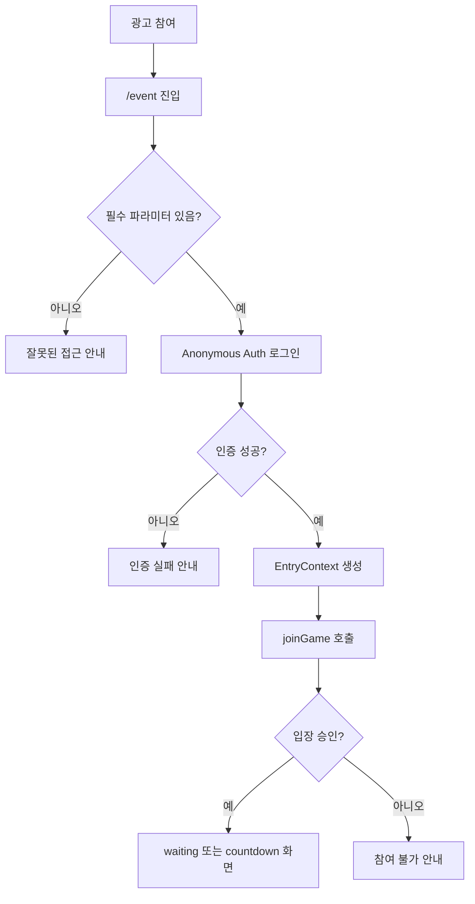
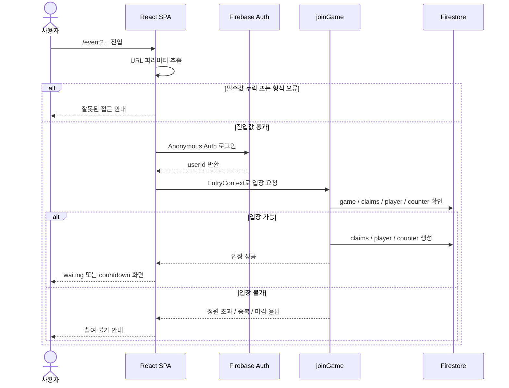

# F01 — 이벤트 진입 및 입장 Flow

## 목적

광고 참여 후 인앱웹뷰로 들어온 사용자가 `/event`에 진입하고, URL 파라미터 검증과 Firebase Anonymous Auth를 거쳐 게임 입장 상태가 되는 흐름을 정의한다.

## 사용자

- 광고를 클릭하고 이벤트에 참여하려는 일반 사용자
- NBT 오퍼월 인앱웹뷰를 통해 진입한 사용자

## 시작 조건

- 사용자가 광고 참여 후 이벤트 링크를 연다.
- Hosting은 모든 SPA 경로를 `index.html`로 rewrite한다.
- 이벤트 URL은 `/event?uid=&advertising_id=&click_key=&pub_code=&pub_app_code=` 형태를 기준으로 한다.

## Happy Path

1. 사용자가 광고 참여 후 이벤트 페이지로 이동한다.
2. 클라이언트가 `/event` 경로인지 확인한다.
3. 클라이언트가 URL 파라미터 5종을 추출한다.
4. T03/T04와 5장 §5.7이 정한 필수·허용 정책에 맞으면 Firebase Anonymous Auth로 로그인한다.
5. 클라이언트는 URL `uid`를 `adisonUid`, Firebase Auth UID를 `userId`로 분리한 `EntryContext`를 만든다.
6. 클라이언트가 `joinGame` Callable을 호출한다.
7. 서버가 정규화, 중복 참여, 정원, 게임 페이즈를 검증한다.
8. 입장이 승인되면 플레이어 상태가 생성되고 사용자는 `waiting` 또는 `countdown` 화면을 본다.

## 처리 순서

## 화면/상태

| 상태 | 사용자에게 보이는 화면 | 처리 기준 |
|---|---|---|
| 진입 확인 중 | 로딩 | URL 파라미터 추출 및 Auth 준비 중 |
| 파라미터 누락 | 잘못된 접근 안내 | 필수 파라미터 누락. 정상 입장으로 보지 않음 |
| 인증 실패 | 인증 실패/재시도 안내 | Anonymous Auth 실패 |
| 입장 처리 중 | 참여 확인 중 | `joinGame` 호출 중 |
| 입장 성공 | 대기 또는 카운트다운 | `joinGame` 승인 |
| 입장 거부 | 참여 마감/중복 참여/재진입 제한 안내 | `joinGame` 거부 코드에 따라 문구 분기 |

## 예외 Flow

### 필수 파라미터 누락

- 필수·선택 판정은 5장 §5.7, T03, T04의 정본을 따른다.
- 필수값이 없거나 빈 문자열이면 `joinGame`을 호출하지 않고 안내 화면을 보여준다.
- `advertising_id`, `pub_app_code`처럼 빈 값 허용 여부가 정책에 걸린 값은 Flow에서 임의 결정하지 않는다.

### 인증 실패

- Auth UID가 없으면 서버 Callable의 `request.auth.uid` 전제가 깨진다.
- 사용자는 재시도 안내를 보고, 반복 실패 시 이벤트 참여가 불가능한 상태로 처리한다.

### 입장 거부

- 정원 초과, 시작 이후 신규 진입, 중복 참여, 같은 Auth UID의 다른 Adison UID 재진입은 `joinGame` 정책을 따른다.
- 세부 응답 코드는 T04에서 구현하고, 화면 문구는 T10에서 연결한다.

## 관련 문서

- Guide: [5. 사용자 식별 및 인증](../guide/05_사용자_식별_및_인증.md)
- Guide: [7. 동시성·정원·중복참여 정책](../guide/07_동시성_정원_중복참여_정책.md)
- Guide: [9. 호스팅·배포·환경](../guide/09_호스팅_배포_환경.md)
- Task: [T03 익명 Auth 및 URL 파라미터](../task/T03_익명_Auth_및_URL_파라미터.md)
- Task: [T04 joinGame 입장 트랜잭션](../task/T04_joinGame_입장_트랜잭션.md)
- Task: [T10 입장 대기 카운트다운 UI](../task/T10_입장_대기_카운트다운_UI.md)
- Task: [T15 호스팅·배포·환경 분리](../task/T15_호스팅_배포_환경.md)

## QA 체크포인트

- 정상 URL 진입 시 5종 파라미터가 의도한 내부명으로 매핑된다.
- 필수 파라미터 누락 시 Auth나 `joinGame` 호출 전 안내 화면으로 끝난다.
- URL `uid`와 Firebase Auth UID가 화면/로그/코드에서 혼용되지 않는다.
- 정원 초과와 시작 이후 신규 입장이 서로 다른 사용자 안내로 구분된다.
- Hosting rewrite와 인앱웹뷰 환경에서 쿼리 파라미터가 손실되지 않는다.
