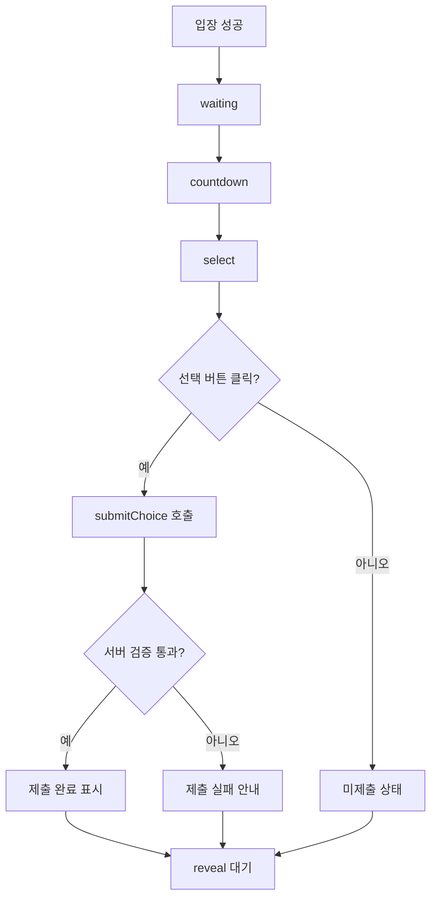
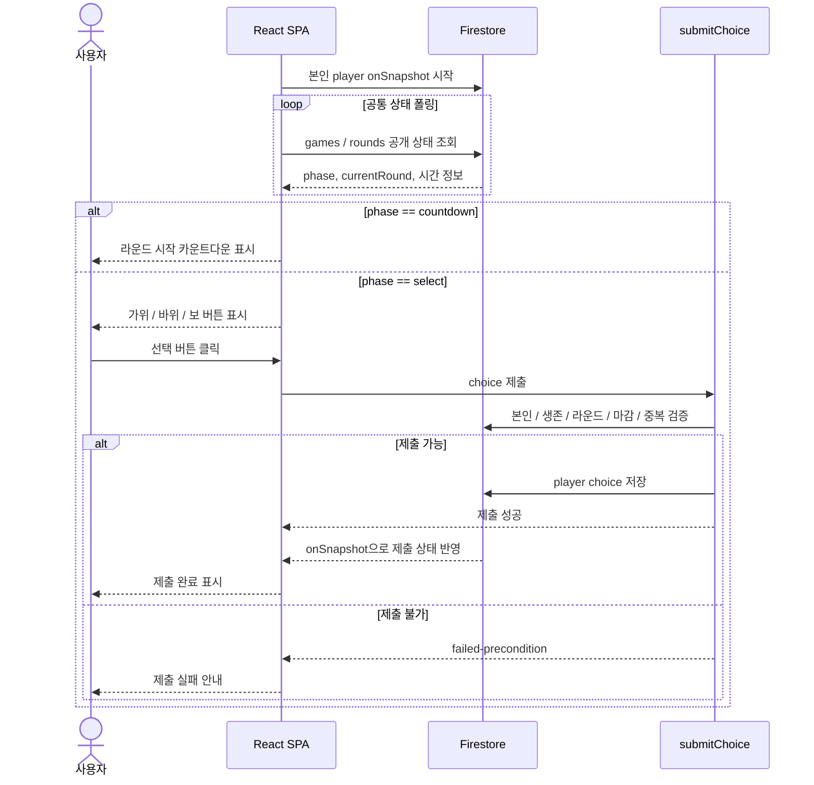

# F02 — 라운드 참여 및 선택 Flow

## 목적

입장한 사용자가 라운드 시작을 기다리고, `select` 페이즈에서 가위·바위·보 중 하나를 한 번 제출하는 흐름을 정의한다.

## 사용자

- 입장 승인된 생존 사용자
- 이전 라운드에서 살아남아 다음 라운드에 진입한 사용자

## 시작 조건

- 사용자는 `joinGame`을 통과해 `players/{userId}` 상태를 가진다.
- 게임은 `waiting` 또는 `countdown` 또는 `select` 중 하나의 진행 상태다.
- 본인 player 상태는 실시간 구독하고, 공통 게임/라운드 상태는 폴링한다.

## Happy Path

1. 사용자는 입장 후 `waiting` 화면에서 게임 시작을 기다린다.
2. 첫 라운드가 시작되면 `countdown` 화면으로 전환된다.
3. 카운트다운이 끝나면 `select` 화면으로 전환된다.
4. 사용자는 가위·바위·보 중 하나를 선택한다.
5. 클라이언트가 `submitChoice` Callable을 호출한다.
6. 서버가 본인 여부, 생존 여부, 현재 라운드, 마감 시각, 중복 제출을 검증한다.
7. 제출이 성공하면 사용자는 제출 완료 상태를 본다.
8. 마감 이후 `reveal`로 전환될 때까지 기다린다.

## 처리 순서

## 화면/상태

| 상태 | 사용자에게 보이는 화면 | 처리 기준 |
|---|---|---|
| `waiting` | 입장 완료/대기 | 신규 입장 수락 가능. 첫 countdown 시작 전 |
| `countdown` | 라운드 시작 카운트다운 | 입력 없음. 선택 시작까지 남은 시간 표시 |
| `select` 미제출 | 선택 버튼 3개와 남은 시간 | `roundEndsAt` 전까지 선택 가능 |
| `select` 제출 완료 | 선택한 값과 제출 완료 표시 | 같은 라운드 재제출 차단 |
| `select` 제출 실패 | 실패 원인 안내 | 마감, 중복 제출, 탈락, 페이즈 불일치 등 |
| 마감 후 미제출 | 결과 대기 안내 | 실제 탈락 판정은 서버 `reveal` 처리에서 확정 |

## 예외 Flow

### 중복 제출

- 같은 라운드에서 두 번째 클릭은 클라이언트에서 먼저 차단한다.
- 서버도 `choiceRound == currentRound`를 기준으로 중복 제출을 거부한다.

### 마감 이후 제출

- `roundEndsAt` 이후 클릭은 서버 기준 시간으로 거부한다.
- 사용자는 결과 처리를 기다린다. 미제출 탈락 확정은 F03에서 확인한다.

### 이미 탈락한 사용자

- 탈락자는 선택 화면으로 돌아가지 않고 관전 Flow(F03)를 따른다.

### 새로고침/재진입

- 본인 player 상태가 `alive`이고 현재 페이즈가 `select`이면 남은 시간과 기존 제출 여부를 복구한다.
- 재진입 정책의 상세 매트릭스는 7장과 F05를 따른다.

## 관련 문서

- Guide: [3. 게임 룰 및 라운드 흐름](../guide/03_게임_룰_및_라운드_흐름.md)
- Guide: [4. 시스템 아키텍처](../guide/04_시스템_아키텍처.md)
- Guide: [8. 자동진행 및 서버리스 함수](../guide/08_자동진행_및_서버리스_함수.md)
- Task: [T05 submitChoice](../task/T05_submitChoice.md)
- Task: [T06 라운드 페이즈 엔진](../task/T06_라운드_페이즈_엔진.md)
- Task: [T10 입장 대기 카운트다운 UI](../task/T10_입장_대기_카운트다운_UI.md)
- Task: [T11 선택 UI](../task/T11_선택_UI.md)

## QA 체크포인트

- `countdown`에서는 선택 버튼이 노출되지 않는다.
- `select` 진입 후 선택 버튼 3개가 표시된다.
- 정상 제출 후 같은 라운드의 두 번째 제출은 서버 호출 전 차단된다.
- 마감 시각 이후 제출 시 `failed-precondition` 안내가 표시된다.
- 미제출 상태에서도 클라이언트가 임의로 탈락 확정을 하지 않고 `reveal` 결과를 기다린다.
