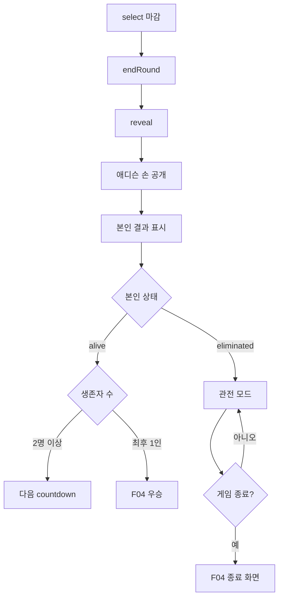

# F03 — 결과 확인 및 관전 Flow

## 목적

`reveal` 페이즈에서 사용자가 애디슨 손, 본인 결과, 라운드 집계를 확인하고, 생존자는 다음 라운드로, 탈락자는 관전 모드로 이동하는 흐름을 정의한다.

## 사용자

- 방금 라운드에 참여한 생존 후보 사용자
- 이전 라운드에서 탈락해 관전 중인 사용자

## 시작 조건

- `select` 마감 시각이 지났다.
- 서버가 `endRound`를 통해 `reveal`로 전이하고 애디슨 손을 공개한다.
- `processBatch`가 승패 판정과 집계를 반영한다.

## Happy Path

1. 게임 상태가 `reveal`로 바뀐다.
2. 사용자는 애디슨 손과 본인 선택을 본다.
3. 서버 판정 결과에 따라 본인 결과가 이김/비김/짐/미제출 중 하나로 표시된다.
4. 라운드 집계가 표시된다.
5. 생존자는 다음 `countdown`으로 이동한다.
6. 탈락자는 관전 모드로 전환된다.
7. 관전자는 공개 가능한 게임/라운드 집계만 보며 다음 라운드 진행을 따라간다.



## 처리 순서

```mermaid
sequenceDiagram
  actor User as 사용자
  participant Web as React SPA
  participant Tasks as Cloud Tasks
  participant End as endRound
  participant PubSub as Pub/Sub
  participant Batch as processBatch
  participant DB as Firestore

  Tasks->>End: 선택 마감 시각에 endRound 호출
  End->>DB: phase / round 가드 확인
  End->>DB: reveal 전이, adminChoice 결정, batch manifest 고정
  End->>PubSub: batch별 processBatch 발행

  loop batch 처리
    PubSub->>Batch: batch 메시지 전달
    Batch->>DB: 선택값 조회, 승패 판정, player/round 집계 갱신
  end

  Web->>DB: game / round 공개 상태 폴링
  DB-->>Web: reveal 상태와 공개 집계
  DB-->>Web: 본인 player onSnapshot 갱신

  alt 본인 alive
    Web-->>User: 결과 확인 후 다음 countdown 안내
  else 본인 eliminated
    Web-->>User: 결과 확인 후 관전 모드
  else 게임 ended
    Web-->>User: F04 종료 화면으로 이동
  end
```

## 화면/상태

| 상태 | 사용자에게 보이는 화면 | 처리 기준 |
|---|---|---|
| `reveal` | 애디슨 손, 본인 선택, 본인 결과 | `adminChoice`는 reveal 이후에만 노출 |
| 라운드 집계 | 생존자 수, 탈락자 수, 선택 분포, 통과 비율 | 공개 가능한 집계만 사용 |
| 생존 | 다음 라운드 안내/카운트다운 | 본인 `status == alive` |
| 탈락 | 관전 모드 | 본인 `status == eliminated` |
| 관전 중 | 현재 라운드 공개 상태와 집계 | 다른 player 개별 정보 읽기 금지 |
| 종료 감지 | 우승/이월/일반 종료 화면으로 이동 | `games.phase == ended` |

## 예외 Flow

### 애디슨 손 조기 노출 방지

- `select` 마감 전에는 어떤 화면에서도 `adminChoice`가 노출되면 안 된다.
- 공개 가능 필드와 보안 규칙은 6장을 따른다.

### batch 처리 지연

- `reveal` 진입 직후 집계가 아직 처리 중일 수 있다.
- 화면은 처리 중/집계 갱신 중 상태를 보여주고, 공개 캐시가 갱신되면 결과를 반영한다.
- 구체적인 partial 상태 필드는 6장/8장 정본을 따른다.

### 관전 모드 정보 제한

- 관전자는 다른 플레이어 목록, 개별 선택, Adison UID, click key, 지급 식별자를 볼 수 없다.
- 관전 화면은 공개 집계와 진행 상태만 사용한다.

## 관련 문서

- Guide: [3. 게임 룰 및 라운드 흐름](../guide/03_게임_룰_및_라운드_흐름.md)
- Guide: [4. 시스템 아키텍처](../guide/04_시스템_아키텍처.md)
- Guide: [6. 데이터 모델 및 보안 정책](../guide/06_데이터_모델_및_보안_정책.md)
- Guide: [8. 자동진행 및 서버리스 함수](../guide/08_자동진행_및_서버리스_함수.md)
- Task: [T07 endRound + batch manifest](../task/T07_endRound_batch_manifest.md)
- Task: [T08 processBatch](../task/T08_processBatch.md)
- Task: [T12 결과/관전 UI](../task/T12_결과_관전_UI.md)

## QA 체크포인트

- `select` 마감 전에는 `adminChoice`가 화면과 네트워크 응답 어디에도 노출되지 않는다.
- `reveal` 진입 시 본인 선택과 애디슨 손을 비교한 결과가 표시된다.
- 미제출자는 결과에서 미제출 탈락으로 확인된다.
- 탈락자는 다음 라운드 선택 화면에 접근하지 않고 관전 모드를 본다.
- 관전 모드는 다른 플레이어 개별 문서를 읽지 않는다.
