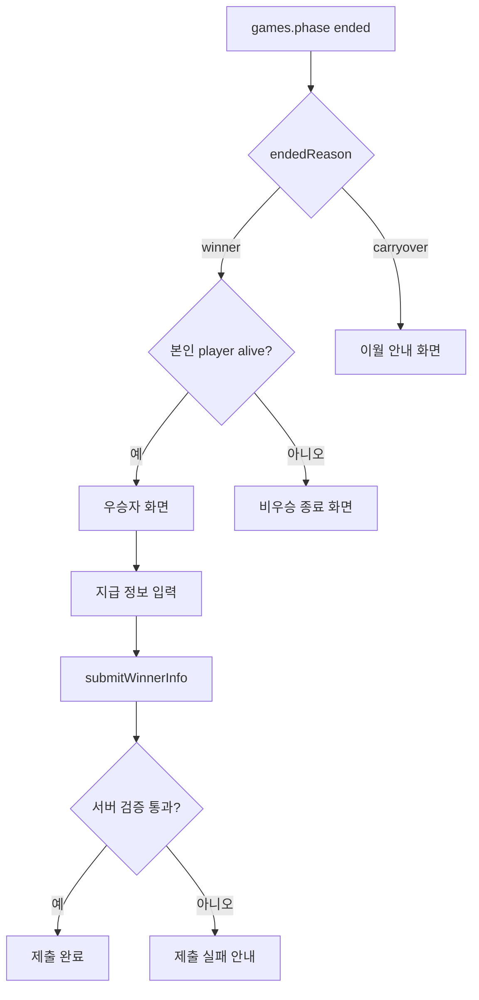
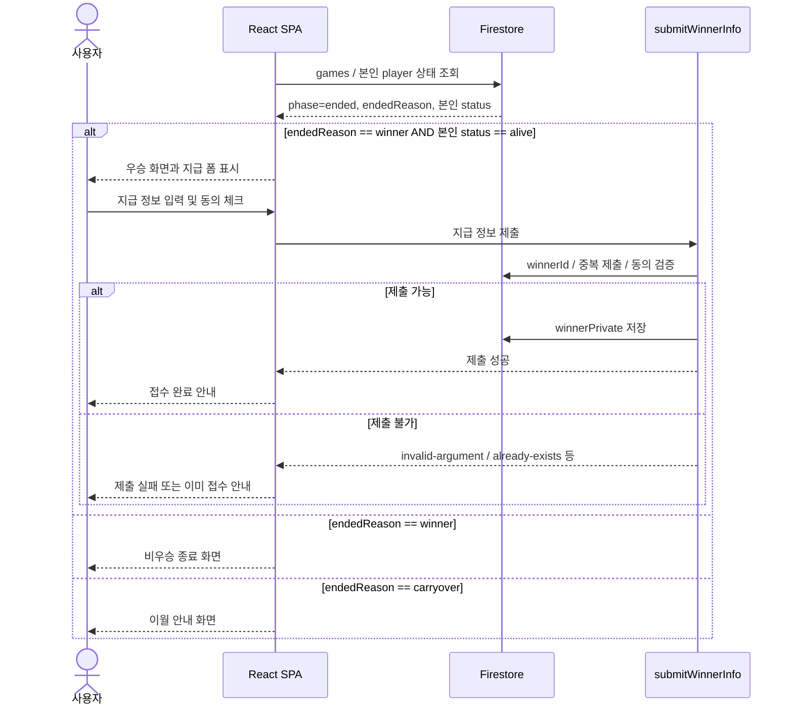

# F04 — 우승 및 지급정보 제출 Flow

## 목적

게임 종료 시 사용자가 우승, 비우승, 이월 중 어느 결과에 해당하는지 확인하고, 우승자만 지급 정보를 제출하는 흐름을 정의한다.

## 사용자

- 최후 1인으로 남은 우승자
- 탈락 후 최종 결과를 보는 비우승자
- 전원 탈락으로 이월 결과를 보는 사용자

## 시작 조건

- 게임 상태가 `ended`다.
- `endedReason`은 `winner` 또는 `carryover`다.
- 우승자 식별과 지급 정보 저장은 서버가 최종 검증한다.

## Happy Path — 우승자

1. 사용자가 `ended` 상태를 감지한다.
2. `endedReason == "winner"`이고 본인 player 상태가 `alive`이면 우승자 화면을 본다.
3. 화면에는 공개 가능한 우승 정보와 지급 정보 제출 안내가 표시된다.
4. 사용자가 실명, 연락처, 주소 등 지급 정보를 입력한다.
5. 필수 동의를 체크한다.
6. `submitWinnerInfo` Callable을 호출한다.
7. 서버가 우승자 본인 여부와 1회 제출 여부를 검증한다.
8. 제출 성공 화면을 보여준다.

## Happy Path — 비우승자/이월

1. 비우승자는 최종 우승자 표시와 재도전 안내를 본다.
2. `endedReason == "carryover"`인 경우 모든 사용자는 이월 안내를 본다.
3. 이월 누적 정책과 구체 문구는 13장 미정 항목을 따른다.

## 처리 순서

## 화면/상태

| 상태 | 사용자에게 보이는 화면 | 처리 기준 |
|---|---|---|
| 우승자 | 우승 축하 + 지급 폼 | `endedReason == winner` 및 본인 player `alive` |
| 지급 제출 중 | 제출 로딩 | `submitWinnerInfo` 호출 중 |
| 지급 제출 완료 | 접수 완료 안내 | 서버 저장 성공 |
| 중복 제출 | 이미 제출됨 안내 | 서버 `already-exists` |
| 비우승자 | 우승자 공개 정보 + 재도전 안내 | 본인 player가 우승자가 아님 |
| 이월 | 우승자 없음/다음 회차 이월 안내 | `endedReason == carryover` |

## 예외 Flow

### 우승자 판정 오인 방지

- 클라이언트는 공개 닉네임만으로 우승자 여부를 판단하지 않는다.
- 최종 권위는 `submitWinnerInfo` 서버 검증이다.
- 닉네임은 unique 보장이 없으므로 폼 노출 게이트로 사용하지 않는다.

### 동의 누락

- 개인정보 수집 동의는 필수다.
- 클라이언트에서 먼저 차단하고, 서버도 `invalid-argument`로 방어한다.

### 중복 제출

- 같은 우승자가 두 번 제출하면 서버가 `already-exists`로 거부한다.
- 화면은 이미 접수된 상태를 안내한다.

## 관련 문서

- Guide: [3. 게임 룰 및 라운드 흐름](../guide/03_게임_룰_및_라운드_흐름.md)
- Guide: [6. 데이터 모델 및 보안 정책](../guide/06_데이터_모델_및_보안_정책.md)
- Guide: [8. 자동진행 및 서버리스 함수](../guide/08_자동진행_및_서버리스_함수.md)
- Guide: [10. 운영 정책 및 관리자 업무](../guide/10_운영_정책_및_관리자_업무.md)
- Task: [T09 submitWinnerInfo](../task/T09_submitWinnerInfo.md)
- Task: [T12 결과/관전 UI](../task/T12_결과_관전_UI.md)
- Task: [T13 우승/종료 및 지급 폼](../task/T13_우승_종료_및_지급_폼.md)

## QA 체크포인트

- 최후 1인만 우승자 지급 폼에 접근한다.
- 비우승자에게 지급 폼이 노출되지 않는다.
- 닉네임 충돌이 있어도 지급 폼 권한 판단에 쓰이지 않는다.
- 동의 미체크 제출은 클라이언트와 서버 양쪽에서 막힌다.
- `carryover` 종료는 우승자 화면과 다른 이월 화면으로 분기된다.
