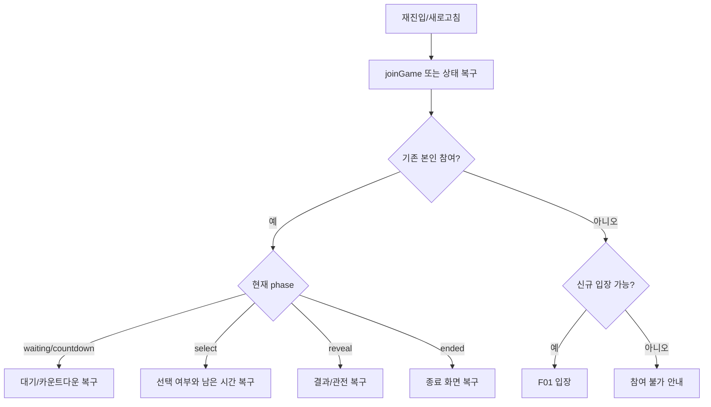
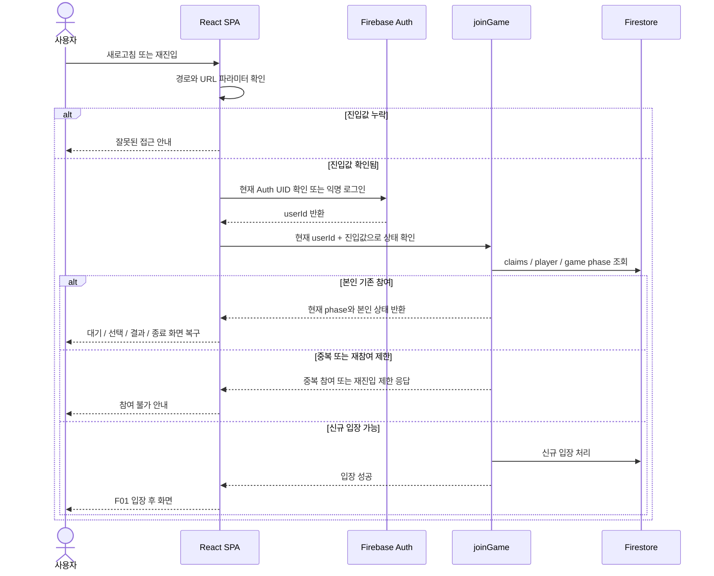

# F05 — 예외 및 재진입 Flow

## 목적

정상 happy path 밖에서 사용자가 만날 수 있는 비정상 진입, 정원 초과, 중복 참여, 새로고침/재진입, 미제출, 처리 지연 상황의 사용자 경험을 정의한다.

## 사용자

- 필수 파라미터가 누락된 URL로 들어온 사용자
- 정원 초과 또는 시작 이후 들어온 사용자
- 같은 광고 식별자나 같은 Auth UID로 다시 들어온 사용자
- 라운드 중 새로고침한 사용자
- 선택하지 않고 마감된 사용자
- 탈락 후 다시 선택하려는 사용자

## 예외 분기 요약

| 상황 | 사용자 경험 | 정본/구현 연결 |
|---|---|---|
| `/event` 외 경로 | 이벤트 진입 안내 또는 redirect | T03, T10, T15 |
| 필수 파라미터 누락 | 잘못된 접근 안내, 입장 호출 없음. 필수·허용 판정은 5장 §5.7, T03, T04를 따름 | F01, T03 |
| Auth 실패 | 인증 실패/재시도 안내 | F01, T03 |
| 정원 초과 | 참여 마감 안내 | T04, T10 |
| 시작 이후 신규 진입 | 이미 시작된 이벤트 안내 | T04, T10 |
| 같은 Adison UID 다른 Auth | 중복 참여 안내 | T04 |
| 같은 Auth 다른 Adison UID | 재참여 제한 안내 | T04 |
| 본인 재로딩 | 현재 상태 복구 | T04, T10~T13 |
| select 중 미제출 | 결과 대기 후 미제출 탈락 | F02, F03, T05, T08, T11 |
| 탈락 후 선택 접근 | 관전 모드 유지 | F03, T11, T12 |
| batch/집계 처리 지연 | 처리 중 안내 후 공개 집계 갱신 | F03, T07, T08, T12 |

## 재진입 원칙

- 본인 재로딩은 가능한 한 현재 상태로 복구한다.
- 새로운 참여로 보이는 재진입은 `joinGame`의 claims/player 정책으로 판단한다.
- `waiting`, `countdown`, `select`, `reveal`, `ended`별 상세 매트릭스는 7장과 T04 정본을 따른다.
- 클라이언트는 서버 상태보다 앞서 생존/탈락/우승을 확정하지 않는다.

## 처리 순서

## 화면 문구 설계 기준

Flow 문서는 문구를 확정하지 않는다. 다만 다음 의도는 구분되어야 한다.

- 잘못된 접근: 이벤트 링크 정보가 부족함
- 참여 마감: 정원 초과 또는 시작 이후 신규 입장 불가
- 중복 참여: 이미 참여한 식별자 또는 기기/세션으로 판단됨
- 네트워크/처리 지연: 서버 상태를 기다리는 중
- 미제출 탈락: 선택 마감까지 제출하지 않아 서버 판정에서 탈락됨

## 관련 문서

- Guide: [5. 사용자 식별 및 인증](../guide/05_사용자_식별_및_인증.md)
- Guide: [7. 동시성·정원·중복참여 정책](../guide/07_동시성_정원_중복참여_정책.md)
- Guide: [8. 자동진행 및 서버리스 함수](../guide/08_자동진행_및_서버리스_함수.md)
- Guide: [13. 리스크·미결정사항·다음 단계](../guide/13_리스크_미결정사항_다음단계.md)
- Task: [T03 익명 Auth 및 URL 파라미터](../task/T03_익명_Auth_및_URL_파라미터.md)
- Task: [T04 joinGame 입장 트랜잭션](../task/T04_joinGame_입장_트랜잭션.md)
- Task: [T05 submitChoice](../task/T05_submitChoice.md)
- Task: [T10 입장 대기 카운트다운 UI](../task/T10_입장_대기_카운트다운_UI.md)
- Task: [T11 선택 UI](../task/T11_선택_UI.md)
- Task: [T12 결과/관전 UI](../task/T12_결과_관전_UI.md)
- Task: [T13 우승/종료 및 지급 폼](../task/T13_우승_종료_및_지급_폼.md)

## QA 체크포인트

- 필수 파라미터 누락은 서버 입장 호출 없이 끝난다.
- 정원 초과와 시작 이후 신규 진입은 모두 입장 불가지만 로그/응답 원인이 구분된다.
- 본인 새로고침은 현재 페이즈와 본인 상태를 복구한다.
- 탈락자는 선택 화면으로 돌아가지 않는다.
- 처리 지연 상태에서 임의로 결과를 확정하지 않는다.
