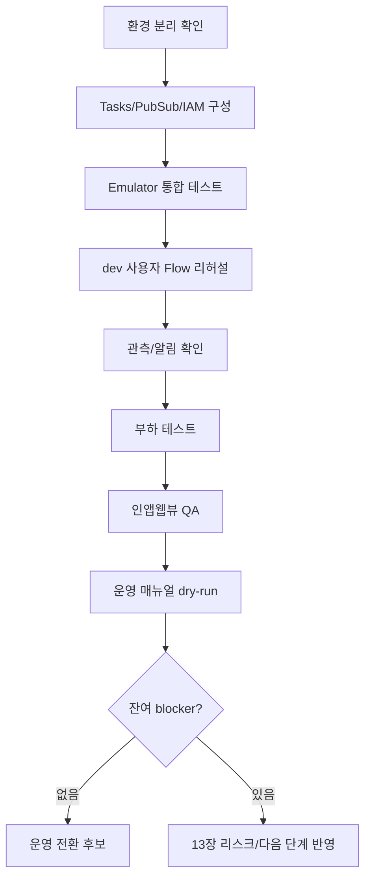
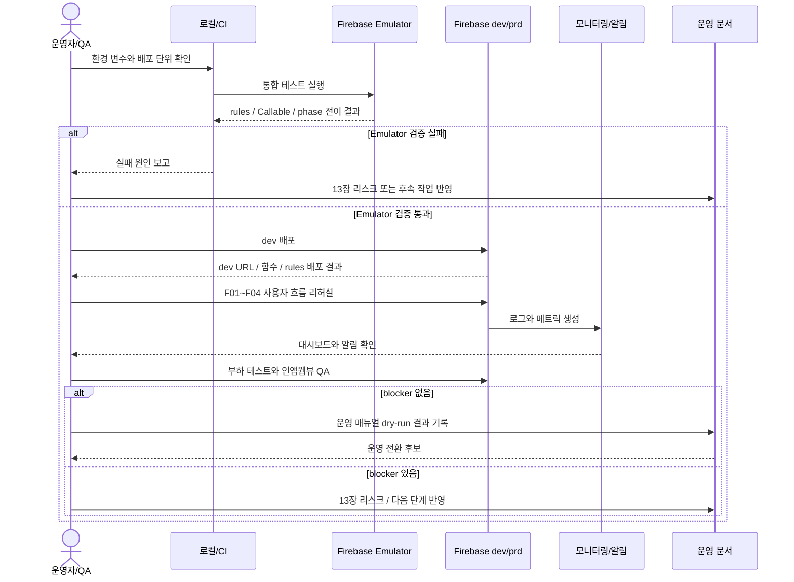

# F06 — 운영 검증 및 전환 Flow

## 목적

운영자가 출시 전 환경, 배포, 자동 진행 인프라, 통합 테스트, 관측, 부하 테스트를 검증하고 운영 전환하는 흐름을 정의한다. 이 문서는 일반 참여자 Flow가 아니라 운영자/QA 사용자 Flow다.

## 사용자

- 개발자
- QA 담당자
- 운영자

## 시작 조건

- 기본 Firebase 프로젝트와 코드 구조가 준비되어 있다.
- Flow F01~F04를 구현할 Task가 최소 dev 환경에서 검증 가능하다.
- 운영 정책 미정 항목은 13장에 남아 있다.

## Happy Path

1. dev/prd 환경 분리와 Hosting/Functions/Rules 배포 단위를 확인한다.
2. Cloud Tasks, Pub/Sub, IAM을 환경별로 구성한다.
3. Emulator에서 보안 규칙, Callable, 페이즈 전이, Pub/Sub 처리, Cloud Tasks 우회를 검증한다.
4. dev 환경에 배포하고 F01~F04 사용자 Flow를 수동/자동으로 리허설한다.
5. 로그 라벨, 대시보드, 알림 라우팅을 확인한다.
6. 1k → 5k → 1만 단계 부하 테스트와 인앱웹뷰 QA를 수행한다.
7. 운영 매뉴얼에 따라 prd dry-run을 수행한다.
8. 남은 리스크와 미결정 항목을 13장에 반영한 뒤 운영 전환 여부를 판단한다.

## 처리 순서

## 운영 체크포인트

| 단계 | 확인 내용 | 관련 Task |
|---|---|---|
| 환경 분리 | dev/prd 프로젝트, region, env 변수, secret 분리 | T01, T15 |
| 배포 | Hosting, Functions, Rules, Indexes, IAM 배포 단위 분리 | T15 |
| 자동 진행 | Cloud Tasks 큐, deterministic task ID, OIDC 검증 | T06, T14 |
| 분산 판정 | Pub/Sub topic, batch manifest, processBatch 멱등성 | T07, T08, T14 |
| 통합 테스트 | 입장→선택→결과→우승/이월 1라운드 이상 | T16 |
| 관측 | env 라벨, batch 상태, 큐 재시도, 알림 라우팅 | T17 |
| 부하/인앱웹뷰 | 1만 동접, URL 파라미터 보존, stale bundle 방지 | T18 |
| 운영 매뉴얼 | 행사 시작/종료, 수동 지급, 장애 대응 | T18 |

## 예외 Flow

### Emulator와 운영 환경 차이

- Cloud Tasks 우회 어댑터는 dev/emulator에서만 활성화되어야 한다.
- prd 빌드에서 우회 분기가 살아 있으면 운영 전환 blocker다.

### IAM/OIDC 실패

- `beginSelect`와 `endRound`는 Tasks Dispatcher SA 외 호출을 401로 거부해야 한다.
- 가드 불일치와 인증 실패는 운영 진단에서 구분되어야 한다.

### 부하 테스트 실패

- 1만 동접에서 batch 누락, aliveCount 불일치, 정원 초과 한계 이탈이 발생하면 운영 전환하지 않는다.
- 원인은 T07/T08/T14/T17/T18 범위로 분해해 수정한다.

## 관련 문서

- Guide: [8. 자동진행 및 서버리스 함수](../guide/08_자동진행_및_서버리스_함수.md)
- Guide: [9. 호스팅·배포·환경](../guide/09_호스팅_배포_환경.md)
- Guide: [10. 운영 정책 및 관리자 업무](../guide/10_운영_정책_및_관리자_업무.md)
- Guide: [12. 부하테스트 및 검증 계획](../guide/12_부하테스트_및_검증계획.md)
- Task: [T14 Cloud Tasks·Pub/Sub·IAM](../task/T14_Cloud_Tasks_PubSub_IAM.md)
- Task: [T15 호스팅·배포·환경](../task/T15_호스팅_배포_환경.md)
- Task: [T16 Emulator 및 통합 테스트](../task/T16_Emulator_및_통합_테스트.md)
- Task: [T17 관측·로그·알림](../task/T17_관측_로그_알림.md)
- Task: [T18 부하 테스트 및 운영 매뉴얼](../task/T18_부하테스트_및_운영_매뉴얼.md)

## QA 체크포인트

- dev/prd 환경이 4축으로 분리되어 있다.
- Emulator에서 F01~F04 핵심 사용자 Flow가 자동 시나리오로 검증된다.
- prd 전환 전 인앱웹뷰에서 5종 URL 파라미터가 유지된다.
- batch 처리와 큐 재시도가 대시보드/알림으로 관측된다.
- 운영 매뉴얼 dry-run 결과의 잔여 항목이 13장으로 반영된다.
