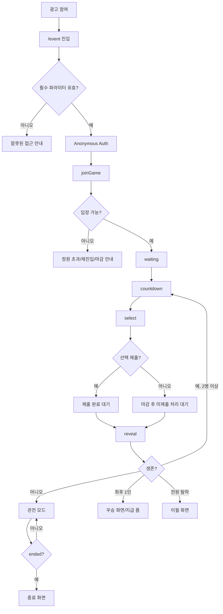

# 사용자 Flow 문서

`docs/flow/`는 가위바위보 챌린지를 **사용자 경험 순서**로 읽기 위한 문서 묶음이다. 기존 `docs/task/`가 구현 PR 단위라면, Flow 문서는 PM·디자인·QA·개발자가 같은 사용자 여정을 기준으로 화면 상태와 예외 분기를 맞추기 위한 중간 계층이다.

```txt
Guide = 정책/정본
Flow  = 사용자 경험과 QA 시나리오
Task  = 구현 단위
```

## 작성 원칙

- Flow 문서는 가이드 정본을 대체하지 않는다. 정책·필드·보안·비용 결정은 `docs/guide/`를 따른다.
- Flow 문서는 구현 상세를 중복하지 않는다. 함수, Firestore, Cloud Tasks 구현 항목은 `docs/task/`를 따른다.
- 미정 정책은 Flow에서 임의 결정하지 않고 [13장 리스크·미결정사항](../guide/13_리스크_미결정사항_다음단계.md)으로 위임한다.
- 각 Flow는 happy path, 예외 경로, 화면/상태, QA 체크포인트, 관련 Task를 함께 둔다.
- 큰 분기는 flowchart로 보고, 실제 요청·응답 순서는 각 Flow의 sequence diagram으로 확인한다.

## Flow 목록

| Flow | 사용자 목표 | 주요 상태/화면 | 관련 Task |
|---|---|---|---|
| [F01 — 이벤트 진입 및 입장](./F01_이벤트_진입_및_입장.md) | 광고 참여 후 이벤트에 정상 입장한다 | `/event`, 파라미터 검증, 익명 Auth, 입장 승인/거부 | T03, T04, T10 |
| [F02 — 라운드 참여 및 선택](./F02_라운드_참여_및_선택.md) | 카운트다운 후 가위·바위·보를 제출한다 | `countdown`, `select`, 제출 완료/마감 | T05, T06, T10, T11 |
| [F03 — 결과 확인 및 관전](./F03_결과_확인_및_관전.md) | 라운드 결과를 보고 생존/탈락에 따라 이어서 본다 | `reveal`, 본인 결과, 집계, 관전 모드 | T07, T08, T11, T12 |
| [F04 — 우승 및 지급정보 제출](./F04_우승_및_지급정보_제출.md) | 우승자는 지급 정보를 제출하고, 비우승자는 종료 결과를 본다 | `ended`, 우승/비우승/이월, 지급 폼 | T09, T12, T13 |
| [F05 — 예외 및 재진입](./F05_예외_및_재진입.md) | 비정상 진입·정원 초과·재진입·미제출 상황을 이해한다 | 오류 안내, 참여 마감, 재로딩 복구, 관전/종료 | T03, T04, T05, T07, T10~T13 |
| [F06 — 운영 검증 및 전환](./F06_운영_검증_및_전환.md) | 운영자가 출시 전 검증과 전환 절차를 수행한다 | Emulator, 배포, 부하 테스트, 모니터링, 운영 매뉴얼 | T14, T15, T16, T17, T18 |

## 전체 사용자 여정



## Flow ↔ Task 매트릭스

| Task | 관련 Flow | 연결 이유 |
|---|---|---|
| T01 | F06 | 프로젝트·환경 준비가 운영 검증 Flow의 기반이다. |
| T02 | F01, F03, F04, F05 | 사용자별 읽기 권한, 공개/비공개 데이터, 오류 분기를 좌우한다. |
| T03 | F01, F05 | `/event` 진입, URL 파라미터, 익명 Auth, 파라미터 누락 안내를 담당한다. |
| T04 | F01, F05 | 입장 승인, 정원 초과, 중복 참여, 재진입 분기를 담당한다. |
| T05 | F02, F05 | 선택 제출, 중복 제출, 마감 후 제출 거부를 담당한다. |
| T06 | F02 | `waiting/countdown/select` 전이와 선택 시간 시작을 담당한다. |
| T07 | F03 | `select → reveal`, 애디슨 손 결정, batch manifest 고정을 담당한다. |
| T08 | F03, F04 | 승패 판정, 생존자 집계, 다음 라운드/종료 분기를 담당한다. |
| T09 | F04 | 우승자 지급 정보 제출을 담당한다. |
| T10 | F01, F02, F05 | 입장 후 대기·카운트다운 UI를 담당한다. |
| T11 | F02, F03, F05 | 선택 UI와 제출 상태 표시를 담당한다. |
| T12 | F03, F04, F05 | 결과, 관전, 종료 분기 화면을 담당한다. |
| T13 | F04, F05 | 우승/비우승/이월 종료 화면과 지급 폼을 담당한다. |
| T14 | F06 | Cloud Tasks, Pub/Sub, IAM 운영 인프라를 담당한다. |
| T15 | F01, F06 | Hosting rewrite, 캐시, 환경 분리, 배포 절차를 담당한다. |
| T16 | F01~F06 | 통합 테스트로 사용자 Flow 전체를 검증한다. |
| T17 | F06 | 운영 관측, 로그, 알림을 담당한다. |
| T18 | F06 | 부하 테스트, 인앱웹뷰 QA, 운영 매뉴얼을 담당한다. |

## QA 사용법

1. Flow 문서에서 대상 사용자와 시작 조건을 고른다.
2. happy path를 자동/수동 테스트 시나리오로 옮긴다.
3. 예외 경로를 별도 테스트 케이스로 만든다.
4. 관련 Task의 완료 조건이 Flow의 QA 체크포인트를 충족하는지 확인한다.
5. Flow가 가이드 정본과 다르면 Flow가 아니라 가이드를 먼저 갱신한다.
