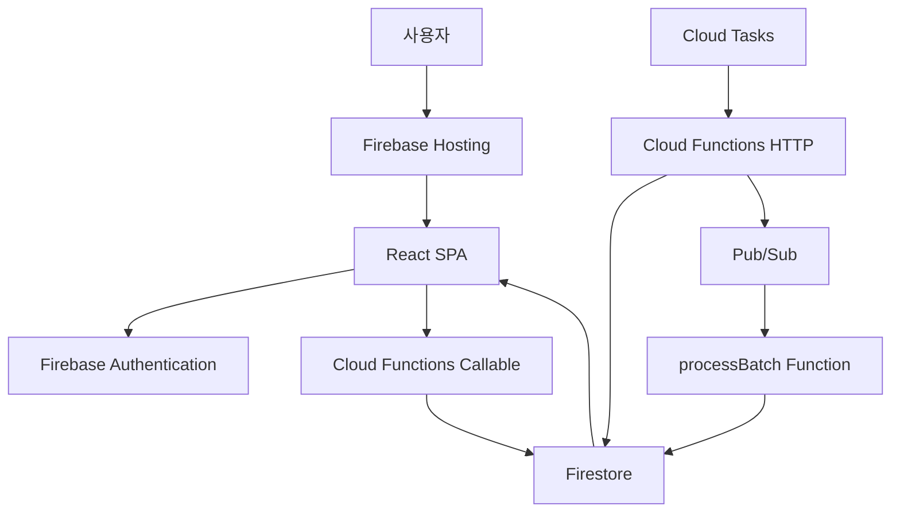

# 1. Firebase 전체 그림

## 한 줄 요약

이 프로젝트에서 Firebase는 **웹페이지를 보여주고, 사용자를 임시로 식별하고, 서버 함수를 실행하고, 게임 상태를 저장하고, 정해진 시간에 작업을 실행하는 도구 묶음**이다.

## 큰 그림



## 서비스별 쉬운 설명

| 서비스 | 쉬운 말 | 이 프로젝트에서 하는 일 |
|---|---|---|
| Firebase Hosting | 정적 웹사이트 배포소 | React 앱을 사용자에게 보여준다. `/event?...` URL도 여기로 들어온다. |
| Firebase Authentication | 사용자 임시 신분증 | 회원가입 없이 Anonymous Auth로 `userId`를 만든다. |
| Firestore | 실시간 문서형 데이터베이스 | 게임, 라운드, 플레이어, 결과 상태를 저장한다. |
| Cloud Functions | 서버 코드 실행기 | `joinGame`, `submitChoice`, `endRound` 같은 검증·처리 로직을 실행한다. |
| Cloud Tasks | 예약 알람/작업 큐 | 카운트다운 종료, 선택 마감 같은 시각에 함수를 호출한다. |
| Pub/Sub | 작업 방송/분배기 | 1만 명 판정을 batch 단위로 나눠 `processBatch`에 전달한다. |
| Firebase Emulator | 로컬 연습장 | 실제 운영 환경에 배포하기 전에 로컬에서 테스트한다. |

## 왜 Firebase를 여러 개 쓰나?

가위바위보 챌린지는 단순 화면만 있는 서비스가 아니다.

- 누가 들어왔는지 알아야 한다.
- 정원이 넘었는지 확인해야 한다.
- 선택 마감 시간이 지나면 자동으로 결과를 내야 한다.
- 1만 명을 한 번에 판정하지 않고 나눠 처리해야 한다.
- 사용자가 직접 조작하면 안 되는 값은 서버에서만 써야 한다.

그래서 역할을 나눈다.

```txt
화면 보여주기       → Hosting + React
사용자 임시 식별    → Anonymous Auth
상태 저장           → Firestore
검증/쓰기 처리      → Cloud Functions
정해진 시간 실행    → Cloud Tasks
대량 작업 분산      → Pub/Sub
로컬 검증           → Emulator
```

## 이 프로젝트의 핵심 원칙

### 1. 클라이언트를 믿지 않는다

사용자 브라우저에서 보내는 값은 조작될 수 있다. 그래서 승패 판정, 탈락, 우승자 확정, 지급 정보 저장 같은 중요한 작업은 Cloud Functions가 다시 검증한다.

### 2. 도메인 쓰기는 서버 함수만 한다

사용자가 Firestore에 직접 게임 상태를 쓰지 않는다. 클라이언트는 Callable Function을 호출하고, 함수가 검증한 뒤 Firestore에 쓴다.

### 3. 공개 데이터와 비공개 데이터를 나눈다

모든 사용자가 봐도 되는 라운드 집계와, 우승자 지급 식별자·개인정보 같은 제한 데이터는 다른 위치에 둔다.

### 4. 한 명 정보는 실시간, 공통 정보는 폴링

본인 상태는 빠르게 바뀌어야 하므로 `onSnapshot`으로 본다. 많은 사람이 보는 공통 상태는 비용 폭증을 줄이기 위해 주기적으로 조회한다.

## 다음에 읽을 문서

- 용어가 낯설면 → [프로젝트 용어집](./02_프로젝트_용어집.md)
- 실제 흐름이 궁금하면 → [사용자 흐름으로 보는 Firebase](./03_흐름별_Firebase_읽기.md)
- 비슷한 말이 헷갈리면 → [자주 헷갈리는 개념](./04_헷갈리는_개념_비교.md)
